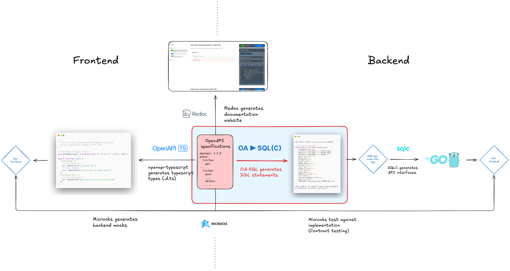

# OpenAPI to PostgreSQL (DDL + INSERT, SELECT, UPDATE, DELETE) library

This library transforms [OpenAPI schemas](https://github.com/OAI/OpenAPI-Specification) into SQL queries, including both **DDL** (Data Definition Language) and **DML** (Data Manipulation Language) operations such as INSERT, SELECT, UPDATE, and DELETE. It can also add specific tags used by the [SQLC library](https://sqlc.dev/).

It processes the  **Components/Schemas section** of an OpenAPI spec for DDL queries and the **paths section** for DML SQL queries.

## Motivation

This library kickstarts your API development by auto-generating DDL & DML queries, bridging the gap in a spec-first API development approach.



By combining it with [SQLC](https://sqlc.dev/), ou can generate the foundation of your API effortlessly.

Moreover, you can establish a fully automated testing environment by combining contract testing with [Microcks](https://microcks.io) and [TestContainers](https://golang.testcontainers.org/).

## Example

MyOpenAPISpec.YAML:
```YAML
openapi: 3.1.0
info:
  title: Complex Properties Schema Test
  version: 1.0.0
components:
  schemas:
    Pet:
      type: object
      required:
        - name
        - photoUrls
      properties:
        id:
          type: integer
          format: int64
        category:
          $ref: '#/components/schemas/Category'
        name:
          type: string
        photoUrls:
          type: array
          items:
            type: string
        tags:
          type: array
          items:
            $ref: '#/components/schemas/Tag'
    Category:
      type: object
      properties:
        id:
          type: integer
          format: int64
        name:
          type: string
    Tag:
      type: object
      properties:
        id:
          type: integer
          format: int64
        name:
          type: string
paths:
  /pets:
     get:
      summary: Retrieve all pets
      operationId: GetAllPets
      tags:
        - pets
      responses:
         '200':
          description: Expected response to a valid request
          content:
            application/json:
              schema:
                type: array
                items: 
                  $ref: "#/components/schemas/Pet"
```

It returns:
```sql
CREATE TABLE IF NOT EXISTS pets (
    id BIGSERIAL NOT NULL PRIMARY KEY,
    category_id INTEGER,
    name TEXT NOT NULL,
    photoUrls JSON NOT NULL,
    tag_id INTEGER,
    FOREIGN KEY (category_id) REFERENCES categories(id),
    FOREIGN KEY (tag_id) REFERENCES tags(id)
);

CREATE TABLE IF NOT EXISTS categories (
    id BIGSERIAL NOT NULL PRIMARY KEY,
    name TEXT
);

CREATE TABLE IF NOT EXISTS tags (
    id BIGSERIAL NOT NULL PRIMARY KEY,
    name TEXT
);

-- name: GetAllPets :many
	SELECT * FROM pets;
```

## Usage

You can use the library either in CLI or in Go.

### In CLI

Run: `go build`

Then: `./OA-SQLC YOUR_OPENAPI.yaml`

### In Go:

```go
import (
    "os"
    "https://github.com/oliviernguyenquoc/oasqlc"
)

openAPISpec, err := os.ReadFile(filePath)
if err != nil {
    fmt.Printf("Failed to read OpenAPI spec: %v\n", err)
    os.Exit(1)
}

sqlStatement, err := oasqlc.OpenAPISpecToSQL(openAPISpec)
if err != nil {
    fmt.Printf("Failed to transform OpenAPI spec to SQL: %v\n", err)
    os.Exit(1)
}
```

## 🚀 Feature Highlights

- 📊 Dynamic Data Type Mapping - Accurately map API properties to PostgreSQL data types (See details in [Openapi Data Type to MySQL Data Type mapping](#openapi-data-type-to-mysql-data-type-mapping) section)
- 🔒 Handle multiple OpenAPI features:
  - Enforce NOT NULL and support DEFAULT values directly from OpenAPI
  - Unique values
  - Enums
- 🔑 Auto Primary Key Setup - Set primary keys on `id` columns.
- ⏱️ Auto Timestamps - Set created_at and updated_at fields as DATES with automatic updates.
- 🔗 Robust Relationship Mapping - Establish and link foreign key relationships as defined in API specs (with `allOf` constructs for sophisticated table inheritance)
- 🚫 Custom Ignore Tag - Optionally exclude schemas with "x-database-entity" tag from database creation.


## Openapi Data Type to MySQL Data Type mapping

| Openapi Data Type | Openapi Data Format | PostgreSQL Data Types |
| ----------------- | ------------------- | --------------------- |
| `integer`         |                     | `INTEGER`             |
| `integer`         | `int32`             | `INTEGER`             |
| `integer`         | `int64`             | `BIGINT`              |
| `boolean`         |                     | `BOOLEAN`             |
| `number`          |                     | `NUMERIC`             |
| `number`          | `float`             | `REAL`                |
| `number`          | `double`            | `DOUBLE PRECISION`    |
| `string`          |                     | `TEXT`                |
| `string`          | `byte`              | `BYTEA`               |
| `string`          | `binary`            | `BYTEA`               |
| `file`            |                     | `BYTEA`               |
| `string`          | `date`              | `DATE`                |
| `string`          | `date-time`         | `TIMESTAMP`           |
| `string`          | `enum`              | `TEXT`                |
| `array`           |                     | `JSON`                |
| `object`          |                     | `JSON`                |
| `\Model\User` (referenced definition) | | `TEXT`                |


## Contributing

We welcome contributions from the community.

## License

This project is licensed under the [MIT License](). See the LICENSE file for details.

## Contact

If you have any questions or suggestions, please open an issue on GitHub.


Inspired by [openapi-generator](https://github.com/OpenAPITools/openapi-generator) and [openalchemy](https://openapi-sqlalchemy.readthedocs.io)
